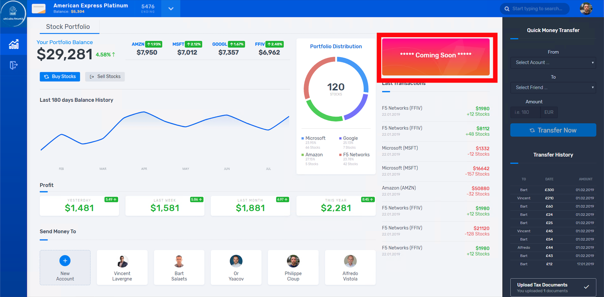
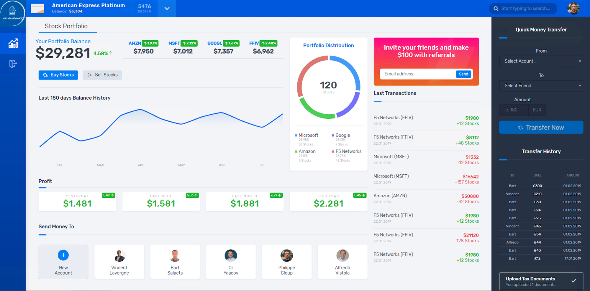

Architecture of Arcadia Application
###################################

.. note :: We will use the famous Arcadia Finance application in this lab. This application is based on 4 microservices. You can find below the different IP addresses and Ports used by NGINX and BIG-IP.

.. note:: This application is available in GitLab in case you want to build your own lab : https://gitlab.com/arcadia-application

First of all, it is important to understand how Arcadia app is split between microservices

**This is how Arcadia App looks like when the 4 microservices are up and running, and you can notice how traffic is routed based on URI**

**But you can deploy Arcadia Step by Step**

If you deploy only ``Main App`` and ``Back End`` services.

.. note:: You can see App2 (Money Transfer) and App3 (Refer Friend) are not available. There is dynamic content showing a WARNING instead of a 404 or blank frame.

|

If you deploy ``Main App``, ``Back End`` and ``Money Tranfer`` services.

|

If you deploy ``Main App``, ``Back End``, ``Money Tranfer`` and ``Refer Friend`` services.

|

**The diagram belows show the IP addresses and the ports used for all the routes**

.. note :: For a lab standpoints, these IP addresses and ports does not change.  But in a real life, they are dynamic.

|