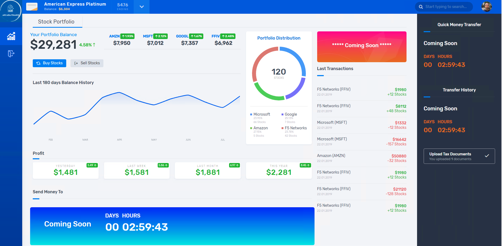
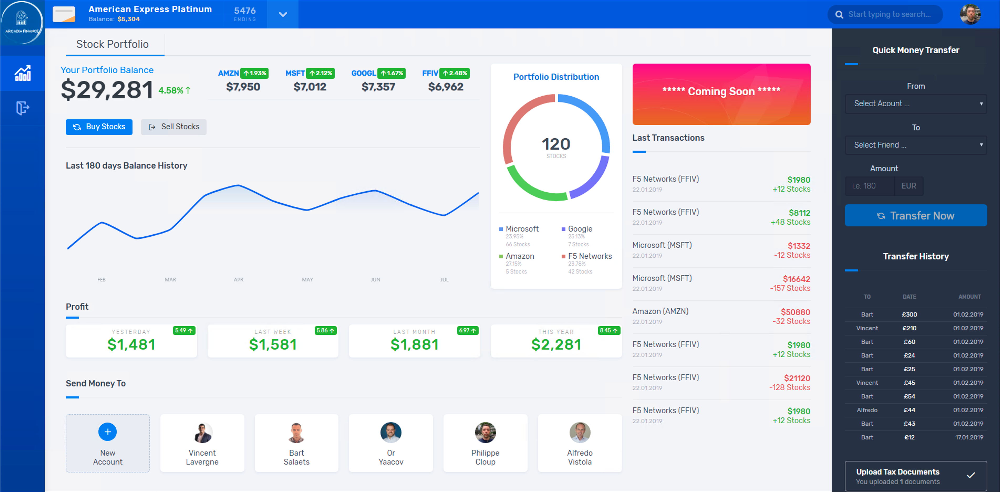

Workflow of the demo
####################

The demo is splitted in 2 classes
    - Deploy, publish and protect Arcadia Web application
        - Deploy and publish Arcadia Main App
        - Deploy and publish Money Transfer App
        - Deploy and publish Refer Friends App
        - Apply WAF policy
    - Publish and protect Arcadia API
        - Publish the API using an OpenAPI 3.0 spec file
        - Check the Developer Portal
        - Protect the API with Advanced WAF and APM using OpenAPI 3.0 spec file

|

Step 1 - DevOps deploy Arcadia application
******************************************

.. note :: Goal is to use the GUI in the NGINX Controller for our traditional customers. NetOps will configure the services (MainApp and BackEnd) manually.

Tasks:

    #. DevOps commit a new code in GitLab in order to publish a brand new application "Arcadia Bank"
    #. GitLab webhooks this commit and ask Jenkins to run a pipeline. This pipeline:
        #. Deploy Arcadia application in Kubernetes (Terraform).
        #. Deploy nodeports in Kubernetes (but it could be KIC) (Terraform).
        #. Deploy NGINX+ instances (ADC) in Docker, in front of this K8S cluster (Terraform)
        #. Create Gateways in NGINX Controller for each NGINX+ instance (Ansible)
        #. Deploy AS3 template into front BIGIP to publish publically the application - without WAF (Ansible)
    #. NetOps create ADC configuration in NGINX controller in order to "route" traffic to the right K8S service
        #. MainApp (/*) to service MainApp
        #. BackEnd (/file*) to service BackEnd

.. warning :: At this stage, the first part of the application is published and can be accessed and demonstrated. We can see Money Transfert application is not yet there, same for Refer Friends.

|

Step 2 - DevOps deploy Money Transfer application
*************************************************

.. note :: Goal is to demonstrate NGINX Controller has a REST API to configure objects. NetOps will configure the service (Money Transfer) via REST API.

Tasks:

    #. DevOps commit a new code in GitLab in order to publish the second part of the Arcadia Bank website. This new application allows money transfer between friends.
    #. GitLab webhooks this commit and ask Jenkins to run a pipeline. This pipeline:
        #. Deploy Money Transfer application in Kubernetes (Terraform)
        #. Deploy nodeports in Kubernetes (Terraform)
    #. NetOps use REST API to publish this new app on NGINX+ instances

.. warning :: At this stage, the Money Transfer application is published and can be accessed and demonstrated

|

Step 3 - DevOps deploy Refer Friends application
************************************************

.. note :: Goal is to demonstrate NGINX Controller can be part of the application lifecycle and CICD. NetOps don't configure anything.

Tasks:

    #. DevOps commit a new code in GitLab in order to publish the third and last part of the Arcadia Bank website. This new application allow a customer to refer friends with their email address.
    #. GitLab webhooks this commit and ask Jenkins to run a Pipeline. This pipeline:
        #. Deploy Refer Friends application in Kubernetes (Terraform)
        #. Deploy nodeports in Kubernetes (Terraform)
        #. Configure all components in NGINX Controller (Ansible)

.. warning :: At this stage, the Refer Friends application is published and can be accessed and demonstrated. The Arcadia Bank website is finished, but not yet secured.

|

Step 4 - NetOps/SecOps publish WAF policy to protect Arcadia application
************************************************************************

.. note :: Goal is to demonstrate BIG-IP Advanced WAF has a Declarative API interface to push WAF policies.

Task:

    #. NetOps run a Jenkins pipeline that will push a new AS3 declaration with a WAF policy built by Secops

.. warning :: At this stage, the Arcadia Bank website is published and secured.

|

Step 5 - Publish Arcadia API
****************************

.. note :: Goal is to demonstrate the new Controller capabilties with API management and gateway

Task:

    #. DevOps provide with an API specification file (OpenAPI 3.0 - OAS3)
    #. NetOps import this file into the Controller APIm and publish the API
    #. SecOps import his file into the BIG-IP and protect the API (WAF + Access)
    #. Developpers can access the new Developper Portal 

.. toctree::
   :maxdepth: 1
   :glob:

   lab*
