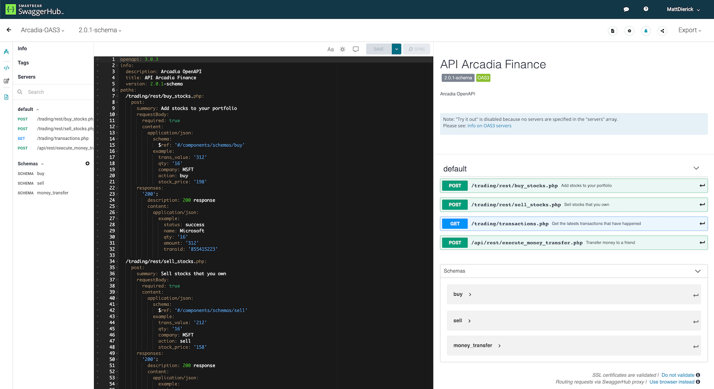

Class 3 - Publish and Protect Arcadia API
#########################################

In this section, we will publish and protect Arcadia API. There are 4 API allowing us to :

   - See last transactions
   - Buy stocks
   - Sell stocks
   - Make a money transfer

The API specification is available here : https://app.swaggerhub.com/apis/F5EMEASSA/Arcadia-OAS3/2.0.1-schema

.. toctree::
   :maxdepth: 1
   :glob:

   module*/module*

|
|
